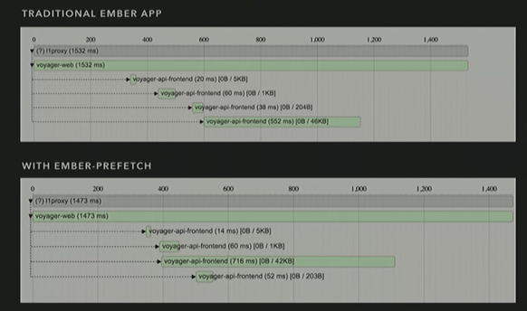

# EmberConf 2016

## [Easy-bake Testing](https://www.youtube.com/watch?v=9Wj01UrGtfs&list=PL4eq2DPpyBblc8aQAd516-jGMdAhEeUiW)

* Ember acceptance test helpers. Three types:
  1. Async (`click`, `fillIn`, ...)
  2. Sync (`currentPath()`, `find()`, ...)
  3. Wait (`andThen`)
* Mirage is a good library for mocking API responses
* Page objects help with class name changes (there's an [addon](http://ember-cli-page-object.js.org/) for that!)
* Most tests should be acceptance, some integration, least of all unit

## [`<select>`ing Good Ember Patterns](https://www.youtube.com/watch?v=yvvst_639oY&list=PL4eq2DPpyBblc8aQAd516-jGMdAhEeUiW)

* [12:47](https://youtu.be/yvvst_639oY?t=12m47s) Good explanation of closure actions
* [19:03](https://youtu.be/yvvst_639oY?t=19m3s) `{{get}}` helper enables checking properties in an `{{each}}` block without creating a new component.
* [20:29](https://youtu.be/yvvst_639oY?t=20m29s) `{{mut}}` helper allows for two-way data binding

## [Ember at Scale](https://youtu.be/xvzM-v9xaEw?list=PL4eq2DPpyBblc8aQAd516-jGMdAhEeUiW)

* BPR 3 modes
  1. *vanilla*: Similar to basic ember app (index.html with script tags)
  2. *ssr*: Similar to [Ember FastBoot](https://github.com/ember-fastboot/ember-cli-fastboot)
  3. *bigpipe*
* What is bigpipe? [Video](https://youtu.be/xvzM-v9xaEw?t=12m40s)
  * Coined by Facebook in 2010 (not new)
  * Keep http connection alive and trunk encode the html being sent to the browser
  * BPR runs the app and makes all requests for requested route
  * Small library on client captures acts as a network proxy to match streamed response from bigpipe
* [Ember prefetch](https://youtu.be/xvzM-v9xaEw?t=17m01s)

* Continue... https://youtu.be/xvzM-v9xaEw?t=19m43s

## [Dissecting an Ember CLI Build](https://youtu.be/hNwgp9alwKg?list=PL4eq2DPpyBblc8aQAd516-jGMdAhEeUiW)

### Broccoli

* Originally based on a **tree**
  1. Directory of files
  2. A string representing a directory path
  3. An object that represents the plugin API
* Plugin
  1. Exports a function that takes 1+ input trees
  2. Performs some transformation
  3. Returns output tree
* "tree" has been renamed to "node"
* What is a node?
  * Falls into 1 of 2 categories: source and transform
  * Source node represents a directory of source files (config watch or unwatch)
  * Transform node represents a directory of transformed files (takes 1+ input nodes and maybe some options)
  * [Example of a very simple ES2015 -> ES5](https://youtu.be/hNwgp9alwKg?t=10m9s)

### Ember CLI

* When running `ember serve` or `ember build`, it will load up the `ember-cli-build.js` file and run anything that was exported.
* When the 'output node'(last node after plugins have been called) is returned, it's passed to the broccoli builder
* [Example using `ember serve`](https://youtu.be/hNwgp9alwKg?t=15m8s)
* `tmp` directory has an 'input' and 'output' directory for each plugin
* Get a visualization of a build with the following commands:

```
BROCCOLI_VIZ = true ember build
dot -Tpng graph.0.dot -o graph.0.png
```

### Extending Ember CLI

* `app.import` called to bring in additional vendor dependencies
* Each source node in the project has a corresponding 'treeFor' hook. Examples:
  - app directory -> treeForApp
  - styles directory -> treeForStyles
  - templates directory -> treeForTemplates
  - public directory -> treeForPublic
  - tests directory -> treeForTestSupport
  - vendor directory -> treeForVendor
* treeForAddon hook for code inside of the addon directory
* [broccoli-stew](https://github.com/stefanpenner/broccoli-stew) will output a node to inspect the content
* `preprocessTree` and `postprocessTree` are called before and after by Ember CLI
  - `pre/postprocessTree('template', templatesNode)`
  - `pre/postprocessTree('css', stylesNode)`
  - `pre/postprocessTree('js', appJsNode)`
  - `pre/postprocessTree('tests', testJsNode)`
  - `postprocessTree('all', outputNode)` (used at the end of all processing has completed)
* See [Docs](http://ember-cli.com/api/classes/Addon.html) on Ember CLI hooks

## [Ember CLI, The Next Generation](https://youtu.be/UMo9DHrRccI)

* What's worked and what hasn't?
  - Worked
    - "batteries included"
    - add-ons
    - bullish on reinvestment
    - awesome community
  - Sorta/kinda worked
    - stability (but could get better)
  - Didn't work
    - enabling community at larger efforts
    - dependencies
    - bundles
    - `<base href="">`
    - broccoli plugins perf
    - Windows experience
* Why broccoli?
  - Just a build pipeline
  - A build pipeline that composes
